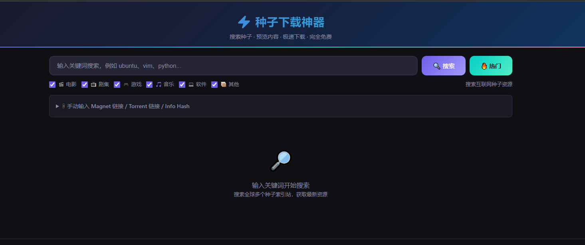

# ⚡ 种子下载神器 - Torrent Downloader

> 🌐 **搜索全球种子资源，极速下载，完全免费，无广告**

一个功能强大的在线种子搜索与下载工具，支持搜索电影、电视剧、音乐、游戏、软件等各类资源，基于 WebTorrent 技术实现浏览器内直接下载。

---

## ✨ 功能特点

| 功能 | 描述 |
|------|------|
| 🔍 **多源搜索** | 聚合 Bitsearch + 海盗湾(TPB) 等多个搜索源 |
| 📦 **资源分类** | 支持电影、剧集、游戏、音乐、软件等分类筛选 |
| ⚡ **极速下载** | 基于 WebTorrent 技术，直接在浏览器下载 |
| 👁 **内容预览** | 下载前预览文件列表，避免下载错误资源 |
| 📱 **响应式设计** | 完美适配桌面端和移动端 |
| 🎨 **精美界面** | 深色主题，现代风格 UI |
| 🚫 **完全免费** | 无广告、无付费墙、无限制 |
| 🔒 **隐私保护** | 不存储任何种子文件，不追踪用户行为 |

---

## 🚀 快速开始


### 方式一：本地运行

```bash
# 克隆仓库
git clone https://github.com/your-username/torrent-downloader.git

# 进入目录
cd torrent-downloader

# 启动本地服务器（任选其一）
# Python 3
python -m http.server 8080

# Node.js
npx serve .

# 访问
open http://localhost:8080
```

---

## 📖 使用说明

1. **搜索资源**：在搜索框输入关键词，支持中英文搜索
2. **筛选分类**：勾选需要的资源类型（电影、剧集、游戏等）
3. **查看详情**：点击搜索结果查看详细信息和文件列表
4. **开始下载**：点击「下载种子」按钮开始下载
5. **手动添加**：支持手动输入 Magnet 链接或 InfoHash

---

## 📷 截图预览



---

## 🛠 技术栈

- **前端框架**: 原生 HTML5 / CSS3 / JavaScript
- **P2P 引擎**: WebTorrent (BitTorrent 协议)
- **搜索源**: Bitsearch + 海盗湾(TPB)
- **CORS 代理**: 内置多代理自动切换

---

## 📁 项目结构

```
torrent-downloader/
├── index.html          # 主页面（包含所有功能）
├── README.md           # 项目说明文档
└── 收款.jpg            # 赞赏支持
```

---

## 📝 更新日志

### v1.0.0
- 🔥 初始版本发布
- ✅ 支持多源种子搜索
- ✅ 支持 WebTorrent 下载
- ✅ 支持分类筛选
- ✅ 支持手动添加 Magnet 链接
- ✅ 深色主题响应式设计

---

## 🤝 贡献指南

欢迎提交 Issue 和 Pull Request！

---

## 💰 支持开发者

如果这个工具对你有帮助，可以请我喝杯咖啡 ☕


---

## 📄 许可证

MIT License - 详见 LICENSE 文件

---

**免责声明**：本工具仅提供种子搜索服务，不存储任何版权内容。请遵守当地法律法规，支持正版资源。

---

> ⚡ **种子下载神器** - 让资源搜索更简单
